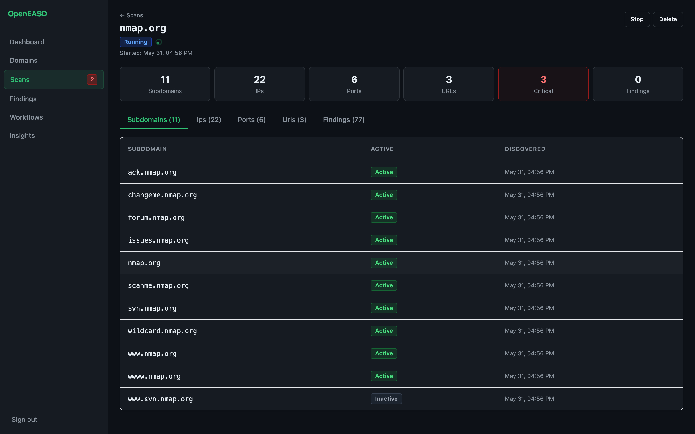

# OpenEASD

[](https://github.com/cybersecify/OpenEASD/stargazers)
[](https://github.com/cybersecify/OpenEASD/actions/workflows/ci.yml)
[](https://github.com/cybersecify/OpenEASD/pkgs/container/openeasd)
[](LICENSE)

**See what attackers see. Use it before they do.**

Use it as a **red teamer** to map external surface fast on a target you're engaged with. Use it as a **defender** to see what's leaking out of your own infrastructure — subdomains, exposed ports, dangling CNAMEs, missing TLS, known CVEs — without paying $500-5000/mo for a commercial EASM platform.

OpenEASD wraps the open-source recon tools security teams already use — `subfinder`, `amass`, `alterx`, `dnsx`, `subzy`, `naabu`, `httpx`, `gau`, `waybackurls`, `nuclei`, `nmap` — behind a single web UI with scheduling, alerts, and findings tracking. Seventeen tools across DNS, email, TLS, SSH, ports, CVEs, subdomain takeover, historical URLs, and web hygiene. Self-hosted, MIT-licensed, one `docker run`. Results stay on your machine.

Built by [Rathnakara G N](https://www.linkedin.com/in/rathnakaragn/) and [Ashok S Kamat](https://www.linkedin.com/in/ashokskamat/) of [Cybersecify](https://cybersecify.com) — the same tool we run in engagements and on our own infrastructure.



## Who this is for

- **In-house security engineers and IT-doing-security teams** at small-to-mid orgs scanning their own external surface
- **Small security consultancies** monitoring a handful of clients
- **Bug bounty hunters** who want a unified view of recon output across programs they're authorised to test
- **Solo self-hosters and security learners** auditing their own infra

## Who this isn't for

- **Enterprise SOCs** — no RBAC, SAML, multi-tenant, or Postgres (yet)
- **Pen testers running one-shot deep enumeration of a single target** — for that, [Tib3rius/AutoRecon](https://github.com/Tib3rius/AutoRecon) and similar CLI tools are better fits. OpenEASD optimises for continuous monitoring across multiple domains over time, not single-target deep dives
- **Anyone needing to scan domains they don't own or aren't authorised to test** — OpenEASD is intentionally not a "scan-anyone" hosted service. Running it implies you own or have written authorisation for your targets

## Quick start

```bash
docker run -d \
  -p 8000:8000 \
  -v openeasd-data:/app/data \
  -v openeasd-logs:/app/logs \
  -e SECRET_KEY="$(openssl rand -hex 32)" \
  -e ALLOWED_HOSTS="*" \
  --cap-add NET_RAW \
  --restart unless-stopped \
  --name openeasd \
  ghcr.io/cybersecify/openeasd:latest
```

Open http://localhost:8000 → log in with `admin` / `admin` (you'll be forced to set a new password) → add a domain → run a scan. Full env-var reference, update path, Kubernetes manifests, and standalone (no-Docker) install are under [Deployment](#deployment).

## Features

- **Automated pipeline** — 17-tool scan workflow from domain to findings
- **Network attack surface scanning** — CVEs, TLS/cert issues, SSH config, network protocol vulnerabilities
- **Dynamic workflows** — Create custom scan configurations, enable/disable tools per workflow
- **Tool auto-registration** — Add new tools with zero core modification
- **Live scan progress** — Real-time pipeline status with per-tool step tracking
- **Scan stop/cancel** — Graceful cancellation between tool steps
- **Unified findings** — All tools write to a single Finding model with lifecycle tracking
- **Continuous monitoring** — Per-domain rescans on a configurable schedule (6h / 12h / 24h / 48h / weekly)
- **Subscan** — Re-run specific tools on existing scan assets without full rediscovery
- **Reports** — CSV and PDF export
- **Alerts** — Slack and Teams webhooks with configurable severity threshold; test button and alert history in the UI
- **Scheduling** — One-time, recurring, and daily automated scans
- **JWT auth** — Stateless Bearer token authentication with refresh token rotation
- **Forced password change** — Default `admin/admin` password must be changed on first login

## Scan Pipeline

```
── Domain Intelligence ──────────────────────────────────────────────────────
Phase 1  Domain Security   - DNS, email (SPF/DMARC/DKIM), RDAP checks

── Surface Enumeration ─────────────────────────────────────────────────────
Phase 2  Subfinder         - Passive subdomain enumeration
Phase 2  Amass             - Active subdomain enumeration
Phase 2  Alterx            - Subdomain permutation from discovered subdomains
Phase 3  DNSx              - DNS resolution, public IP filtering
Phase 4  Takeover Check    - Subdomain takeover detection via subzy

── Port Discovery ───────────────────────────────────────────────────────────
Phase 5  Naabu             - TCP port scanning (top 100)
Phase 6  Service Detection - Classify ports as web/non-web via nmap -sV (auto)

── Network Exposure ─────────────────────────────────────────────────────────
Phase 7  Nmap              - CVE scanning via NSE vulners (non-web ports)
Phase 7  TLS Checker       - Certificate, cipher, and protocol analysis
Phase 7  SSH Checker       - SSH configuration audit
Phase 7  Nuclei Network    - Network protocol vuln templates (non-web ports)

── Web Exposure ─────────────────────────────────────────────────────────────
Phase 8  httpx             - Web probing, URL discovery
Phase 9  Historical URLs   - Archived URL discovery via gau + waybackurls
Phase 10 Katana            - Deep URL crawl on top of httpx
Phase 11 Nuclei            - Web vulnerability scanning (community templates)
Phase 11 Web Checker       - Security headers, cookies, CORS analysis
```

## Architecture

```
apps/core/              - Infrastructure (never changes)
  api/                  - Django Ninja API, JWT auth, error handlers
  api/tokens/           - BlacklistedToken model (JWT JTI blacklist)
  assets/               - Network assets: Subdomain, IPAddress, Port
  web_assets/           - Web assets: URL
  service_detection/    - Classifies ports as web/non-web (core, always runs)
  findings/             - Unified Finding model
  scans/                - ScanSession, pipeline orchestrator
  workflows/            - Dynamic workflow engine + tool registry
  scheduler/            - Django-Q2 scheduling, daily/weekly scans, per-domain monitoring, stuck scan watchdog
  notifications/        - Slack/Teams alerts
  insights/             - Scan summaries, charts
  reports/              - CSV/PDF export
  domains/              - Domain management
  dashboard/            - UI home

apps/                   - Tool apps (add/remove freely)
  domain_security/      - DNS, email, RDAP checks
  subfinder/            - Passive subdomain enumeration
  amass/                - Active subdomain enumeration
  alterx/               - Subdomain permutation (from discovered subdomains)
  dnsx/                 - DNS resolution
  takeover_check/       - Subdomain takeover detection (subzy)
  naabu/                - Port scanning
  nmap/                 - CVE scanning (NSE vulners)
  tls_checker/          - TLS/cert/cipher analysis
  ssh_checker/          - SSH configuration audit
  nuclei_network/       - Network protocol vuln scanning
  httpx/                - Web probing
  historical_urls/      - Archived URL discovery (gau + waybackurls)
  katana/               - Deep URL crawl
  nuclei/               - Web vulnerability scanning
  web_checker/          - Security headers, cookies, CORS

frontend/               - React 19 + Vite 8 SPA
  src/pages/            - Page components
  src/components/       - Shared UI primitives (Badge, Spinner, Pagination, ConfirmButton)
  src/components/ui/    - shadcn/ui primitives (Button, Card, Table, AlertDialog, …)
  src/hooks/            - useFetch, usePolling
  src/api/client.js     - JWT apiFetch wrapper
  src/auth.js           - localStorage token helpers
```

## Deployment

### Docker (recommended)

```bash
docker run -d \
  -p 8000:8000 \
  -v openeasd-data:/app/data \
  -v openeasd-logs:/app/logs \
  -e SECRET_KEY="$(openssl rand -hex 32)" \
  -e ALLOWED_HOSTS="*" \
  --cap-add NET_RAW \
  --restart unless-stopped \
  --name openeasd \
  ghcr.io/cybersecify/openeasd:latest
```

Open http://localhost:8000 — log in with `admin` / `admin`. You will be forced to set a new password before accessing the app.

> **Production note:** `ALLOWED_HOSTS="*"` is fine for evaluation on a private network. For internet-facing deployments, narrow it to your actual hostname or IP (e.g. `ALLOWED_HOSTS="scanner.example.com,127.0.0.1"`) and set `CSRF_TRUSTED_ORIGINS` if accessing over a domain.

#### Update to latest

```bash
docker pull ghcr.io/cybersecify/openeasd:latest
docker stop openeasd && docker rm openeasd
# re-run the docker run command above — volumes preserve all data
```

#### Environment variables

| Variable | Default | Description |
|---|---|---|
| `SECRET_KEY` | insecure default | Django secret key — **set this in production** |
| `ALLOWED_HOSTS` | `localhost,127.0.0.1` | Comma-separated hostnames (add your server IP/domain) |
| `CSRF_TRUSTED_ORIGINS` | — | Required if accessing via a domain, e.g. `https://openeasd.example.com` |
| `DEBUG` | `False` | Set `True` only for local development |
| `DB_NAME` | `data/openeasd.db` | SQLite path relative to `/app` |
| `SLACK_WEBHOOK_URL` | — | Slack incoming webhook for scan alerts (can also be set in the Notifications UI) |
| `MS_TEAMS_WEBHOOK_URL` | — | Teams incoming webhook for scan alerts (can also be set in the Notifications UI) |
| `ALERT_SEVERITY_THRESHOLD` | `high` | Minimum severity to trigger alerts — overridden by the Notifications UI setting |
| `SCAN_DAILY_HOUR` | `2` | Hour for daily scheduled scans (24h, UTC) |
| `SCAN_DAILY_MINUTE` | `0` | Minute for daily scheduled scans |
| `REPORT_CTA_URL` | — | Optional URL appended to PDF and CSV reports. Renders only when both `REPORT_CTA_URL` and `REPORT_CTA_TEXT` are set |
| `REPORT_CTA_TEXT` | — | Optional call-to-action line shown alongside `REPORT_CTA_URL` in PDF/CSV reports |

### Kubernetes

Manifests are in `k8s/`. Requires a cluster with an nginx Ingress controller.

**1. Set your secret**

Edit `k8s/secret.yaml` and replace `REPLACE_WITH_OPENSSL_RAND_HEX_32` with a real key:

```bash
openssl rand -hex 32
```

**2. Set your domain**

Edit `k8s/configmap.yaml` (`ALLOWED_HOSTS`, `CSRF_TRUSTED_ORIGINS`) and `k8s/ingress.yaml` (`host`) to match your domain.

**3. Deploy**

```bash
kubectl apply -k k8s/
```

**4. Update to latest image**

```bash
kubectl rollout restart deployment/openeasd-web deployment/openeasd-worker -n default
```

#### Architecture

Single pod, two containers, one `ReadWriteOnce` PVC:

| Container | Command | Resources |
|---|---|---|
| `web` | `gunicorn` (2 workers) | 256Mi–512Mi |
| `worker` | `manage.py qcluster` | 512Mi–1Gi, `NET_RAW` capability |

An init container runs migrations and admin user setup before the main containers start. The `worker` container gets `NET_RAW` capability for nmap/naabu port scanning.

> **SQLite constraint:** `replicas: 1` is required. To scale horizontally, migrate to PostgreSQL.

#### Health check

`GET /health/` returns `{"status": "ok"}` — used by K8s readiness and liveness probes (no auth required).

### Standalone (no Docker)

The fastest way to get running on a Linux server or macOS without Docker:

```bash
git clone https://github.com/cybersecify/OpenEASD.git
cd OpenEASD

# Linux (installs all deps + systemd services)
sudo ./install.sh

# macOS
./install.sh

# Skip amass if you don't need active subdomain enumeration (saves ~10 min)
sudo ./install.sh --skip-amass
```

The script installs: Python/uv, Node.js, nmap, ProjectDiscovery tools (subfinder, dnsx, naabu, httpx, nuclei), amass, builds the frontend, generates a `.env` with a random `SECRET_KEY`, runs migrations, creates the `admin` user, grants `NET_RAW` to nmap/naabu, and sets up `systemd` services on Linux.

After install, edit `.env` to add your domain to `ALLOWED_HOSTS` and `CSRF_TRUSTED_ORIGINS`, then restart:

```bash
sudo systemctl restart openeasd-web openeasd-worker
```

On macOS, start manually:

```bash
uv run gunicorn openeasd.wsgi:application --bind 0.0.0.0:8000 --workers 2
uv run manage.py qcluster   # second terminal
```

### Development Mode

```bash
# Terminal 1 — Django + Django-Q2 worker
uv run python main.py

# Terminal 2 — Vite dev server (proxies /api/ to Django on port 8000)
cd frontend && npm run dev
# React app at http://localhost:5173
```

### main.py flags

```bash
uv run python main.py --build          # npm build then start
uv run python main.py --build-only     # npm build only
uv run python main.py --port 9000      # custom port
uv run python main.py --no-worker      # web server only (no worker)
```

## CI/CD

GitHub Actions runs on every push to `main` and `v*` tags:
- **pytest** — fast test suite (~750 tests, excludes the 41 slow DNS/RDAP tests in `test_domain_security.py`)
- **bandit** — Python SAST scan
- **pip-audit** — dependency CVE scan
- **Frontend build** — `npm ci && npm run build`
- **Docker build** — amd64 smoke-build on every push
- **Publish to GHCR** — multi-arch (`amd64` + `arm64`) image published on every `main` push and version tags

## API

The REST API is served at `/api/` via Django Ninja with JWT Bearer authentication.

- **Docs:** http://localhost:8000/api/docs (OpenAPI/Swagger UI)
- **Auth:** `POST /api/token/pair` → `{access, refresh}` tokens
- **Token refresh:** `POST /api/token/refresh`

## Adding a New Tool

Create a tool app with `tool_meta` in its AppConfig — no core files to modify:

```python
# apps/my_tool/apps.py
from django.apps import AppConfig

class MyToolConfig(AppConfig):
    name = "apps.my_tool"
    label = "my_tool"
    verbose_name = "My Tool"
    tool_meta = {
        "label": "My Tool",
        "runner": "apps.my_tool.scanner.run_my_tool",
        "phase": 6,
        "phase_group": "Port Discovery",
        "requires": ["naabu"],
        "produces_findings": True,
    }
```

Then add `"apps.my_tool"` to `INSTALLED_APPS` in `openeasd/settings.py`. The tool auto-registers in the workflow system.

### Tool App Structure

```
apps/my_tool/
    apps.py         - AppConfig with tool_meta
    models.py       - Empty (uses core Finding/asset models)
    scanner.py      - Orchestrator: collect -> analyze -> save
    collector.py    - Runs binary or probes, returns raw data
    analyzer.py     - Parses data, builds Finding/asset objects
```

## Running Tests

```bash
# Fast tests (excludes slow DNS tests, ~750 tests)
uv run pytest tests/ --ignore=tests/unit/test_domain_security.py

# All tests (~670 total)
uv run pytest tests/
```

## Tech Stack

**Backend:**
- **Django 5** — Web framework
- **Django Ninja** — REST API with OpenAPI docs
- **Django-Q2** — Background task queue and scheduler (ORM broker, replaces APScheduler)
- **croniter** — Cron expression parsing for Django-Q2 CRON schedules
- **WhiteNoise** — Serves static files in production (Docker) with gzip compression
- **SQLite** — Database (dev), configurable via `DB_NAME`
- **paramiko** — SSH protocol inspection
- **cryptography** — X.509 certificate analysis
- **xhtml2pdf** — PDF report generation
- **django-ninja-jwt** — JWT auth for the Ninja API (built on PyJWT); access + refresh tokens, blacklist on logout

**Frontend:**
- **React 19 + Vite 8** — SPA with hot module replacement
- **Tailwind CSS 3 + shadcn/ui** — Utility-first styling with Radix UI component primitives
- **sonner** — Toast notifications
- Vanilla popstate router (no react-router)

## License

MIT License - see [LICENSE](LICENSE)

## Author

[Rathnakara G N](https://www.linkedin.com/in/rathnakaragn/) and [Ashok S Kamat](https://www.linkedin.com/in/ashokskamat/) / [Cybersecify](https://cybersecify.com)
